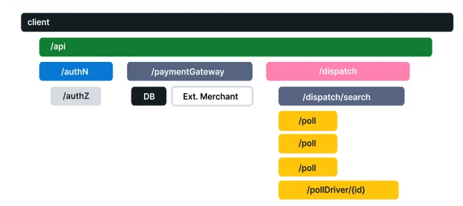

# Observability (o11y)

## Introduction

Definition of o11y varies by vendor. Here's our take on o11y:

---
> **Google**: Observability is tooling or a technical solution that allows teams to actively debug their system. Observability is based on exploring properties and patterns not defined in advance.
---
> **OpenTelemetry**: Observability lets us understand a system from the outside, by letting us ask questions about that system without knowing its inner workings. Furthermore, it allows us to easily troubleshoot and handle novel problems (i.e. “unknown unknowns”), and helps us answer the question, “Why is this happening?”
---
> **Telemetry** refers to data emitted from a system, about its behavior. The data can come in the form of [metrics](#reliability--metrics), [traces](#distributed-traces) & [logs](#logs) (MTL).
>
> **OpenServiceFramework** (OSF) will be using **OpenTelemetry** standards, framework & tools
---

## OpenTelemetry

**OpenTelemetry** (OTel) is a vendor-neutral open-source Observability framework for instrumenting, generating, collecting, and exporting telemetry data. As an industry-standard it is natively supported by a number of vendors.

## Reliability & Metrics

**Reliability** answers the question: “Is the service doing what users expect it to be doing?” A system could be up 100% of the time, but if, when a user clicks “Add to Cart” to add a black pair of pants to their shopping cart, and instead, the system keeps adding a red pair of pants, then the system would be said to be unreliable.

**Metrics** are aggregations over a period of time of numeric data about your infrastructure or application. Examples include: system error rate, CPU utilization, request rate for a given service.

**SLI**, or Service Level Indicator, represents a measurement of a service’s behavior. A good SLI measures your service from the perspective of your users. An example SLI can be the speed at which a web page loads.

**SLO**, or Service Level Objective, is the means by which reliability is communicated to an organization/other teams. This is accomplished by attaching one or more SLIs to business value.

## Understanding Distributed Tracing

To understand **Distributed Tracing**, let’s start with some basics.

### Logs

A **Log** is a timestamped message emitted by services or other components. Unlike [Traces](#distributed-traces), however, they are not necessarily associated with any particular user request or transaction. They are found almost everywhere in software, and have been heavily relied on in the past by both developers and operators alike to help them understand system behavior.

> More details: [Logging Best Practices](logging.md)

Sample Log:

```text
I, [2021-02-23T13:26:23.505892 #22473]  INFO -- : [6459ffe1-ea53-4044-aaa3-bf902868f730] Started GET "/" for ::1 at 2021-02-23 13:26:23 -0800
```

Unfortunately, logs aren’t extremely useful for tracking code execution, as they typically lack contextual information, such as where they were called from.

They become far more useful when they are included as part of a Span.

### Spans

A **Span** represents a unit of work or operation. It tracks specific operations that a request makes, painting a picture of what happened during the time in which that operation was executed.

A Span contains name, time-related data, structured log messages, and other metadata (i.e. Attributes) to provide information about the operation it tracks.

Below is a sample of the type of information that would be present in a Span:

| Key | Value |
|-----|-------|
| net.transport | IP.TCP |
| net.peer.ip | 10.244.0.1 |
| net.peer.port | 10243 |
| net.host.name | localhost |
| http.method | GET |
| http.target | /cart |
| http.server_name | frontend |
| http.route | /cart |
| http.scheme | http |
| http.host | localhost |
| http.flavor | 1.1 |
| http.status_code | 200 |
| http.user_agent | Mozilla/5.0 (Macintosh; Intel Mac OS X 10_15_7) AppleWebKit/537.36 (KHTML, like Gecko) Chrome/106.0.0.0 Safari/537.36 |

### Distributed Traces

A **Distributed Trace**, more commonly known as a **Trace**, records the paths taken by requests (made by an application or end-user) as they propagate through multi-service architectures, like microservice and serverless applications.

Without tracing, it is challenging to pinpoint the cause of performance problems in a distributed system.

It improves the visibility of our application or system’s health and lets us debug behavior that is difficult to reproduce locally. Tracing is essential for distributed systems, which commonly have nondeterministic problems or are too complicated to reproduce locally.

Tracing makes debugging and understanding distributed systems less daunting by breaking down what happens within a request as it flows through a distributed system.

A Trace is made of one or more Spans. The first Span represents the Root Span. Each Root Span represents a request from start to finish. The Spans underneath the parent provide a more in-depth context of what occurs during a request (or what steps make up a request).

Many Observability back-ends visualize Traces as waterfall diagrams that may look something like this:



## Instrumenting

In order to make a system observable, it must be instrumented: That is, code from the system’s components must emit [metrics](#reliability--metrics), [traces](#distributed-traces) & [logs](#logs)

Without being required to modify the source code you can collect telemetry from an application using [Automatic Instrumentation](https://opentelemetry.io/docs/reference/specification/glossary/#automatic-instrumentation). If you previously used an APM agent to extract telemetry from your application, Automatic Instrumentation will give you a similar out of the box experience.

To facilitate the instrumentation of applications even more, you can [manually instrument](https://opentelemetry.io/docs/reference/specification/glossary/#manual-instrumentation) your applications by coding against the OpenTelemetry APIs.

> Note, that for most languages it is possible to use both manual and automatic instrumentation at the same time: Automatic Instrumentation will allow you to gain insights into your application quickly and manual instrumentation will enable you to embed granular observability into your code.
>
> Application owners won’t tolerate latency degradations of more than a few percent, so these tools must be nonintrusive and have minimal overhead.
>
> As with all profiling tools, observer distortion must be minimized to enable meaningful analysis.

## References

- [Wikipedia](https://en.wikipedia.org/wiki/Software_observability)
- [Continouse Profiling](https://www.cncf.io/blog/2022/05/31/what-is-continuous-profiling/)
- [Google-Wide Profiling Whitepaper](https://research.google/pubs/pub36575/)
- [OpenTelemetry](https://opentelemetry.io/docs/)
- [Metrics in OpenTelemetry](https://opentelemetry.io/docs/concepts/signals/metrics/)
- [Traces in OpenTelemetry](https://opentelemetry.io/docs/concepts/signals/traces/)
  - [Spans in OpenTelemetry](https://opentelemetry.io/docs/concepts/signals/traces/#spans-in-opentelemetry)
- [Logs in OpenTelemetry](https://opentelemetry.io/docs/concepts/signals/logs/)
